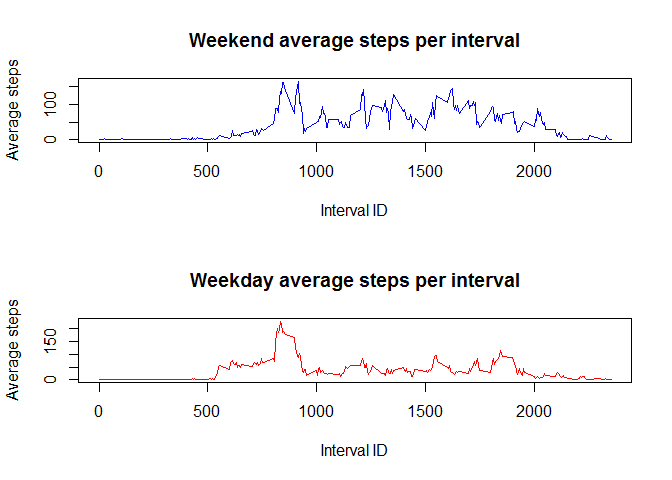

# Reproducible Research: Peer Assessment 1

## Loading and preprocessing the data

1) We read the CSV file into memory, assuming the activity.csv file is in the current working directory


```r
activity <- read.csv("activity.csv", header=T, sep=",")
```

2) We perform some basic checks: number of rows, variables and complete rows:


```r
summary(activity)
```

```
##      steps                date          interval     
##  Min.   :  0.00   2012-10-01:  288   Min.   :   0.0  
##  1st Qu.:  0.00   2012-10-02:  288   1st Qu.: 588.8  
##  Median :  0.00   2012-10-03:  288   Median :1177.5  
##  Mean   : 37.38   2012-10-04:  288   Mean   :1177.5  
##  3rd Qu.: 12.00   2012-10-05:  288   3rd Qu.:1766.2  
##  Max.   :806.00   2012-10-06:  288   Max.   :2355.0  
##  NA's   :2304     (Other)   :15840
```

```r
nrows <- nrow(activity)
ncols <- ncol(activity)
```
The number of rows in the activity data set is 'r nrows' over 'r ncol(activity)' variables.

3) We now convert the date from level to character.


```r
activity$date <- as.character(activity$date)
```


## What is mean total number of steps taken per day?
1) We aggregate the steps taken by day and calculate its mean and median.


```r
totalsteps <- tapply(activity$steps, activity$date, sum)
meanSteps <- mean(totalsteps, na.rm=TRUE)
medianSteps <- median(totalsteps, na.rm=TRUE)
```

The mean of steps taken per day is 10766. The median of steps taken per day is 10765. 

2) We can also draw the total step count for each day as historgram:


```r
hist(totalsteps, 
     breaks=20,
     main="Total # of steps taken per day", 
     col="red", 
     xlab="Steps taken")
```

 


## What is the average daily activity pattern?

1) We make a time series plot (i.e. type = "l") of the 5-minute interval (x-axis)
and the average number of steps taken, averaged across all days (y-axis), i.e. what is the average number of steps taken for each intervall across all days? (note that intervall IDs repeat every 24 hours)


```r
avgs <- aggregate(x=list(steps=activity$steps), by=list(interval=activity$interval), FUN=mean, na.rm=TRUE)
plot( x=avgs[,1], 
      y=avgs[,2], 
      type="l",
      col="blue",
      main="Average # of steps taken per interval",
      ylab="average number of steps taken", 
      xlab="5-minute interval")
```

 

2) We now determine which 5-minute interval, on average across all the days in the dataset, contains the maximum number of steps.


```r
avgs[which.max(avgs$steps),]
```

```
##     interval    steps
## 104      835 206.1698
```

The interval with the maxium number of steps across all days is 835, 206.1698113.


## Imputing missing values

1) We calculate and report the total number of missing values in the dataset (i.e. the total number of rows with NAs)


```r
missing <- is.na(activity$steps)
# How many missing
table(missing)
```

```
## missing
## FALSE  TRUE 
## 15264  2304
```

```r
nas   <- sum(is.na(activity))
complete <- sum(complete.cases(activity))
```
Overall there are  2304 incomplete rows containing NAs and 15264 complete rows.

2) For filling in the missing values, we match intervall IDs and use the mean steps across all days for a given interval to populate the NAs in the newly created dataframe: 


```r
# Replace each missing value with the mean value of its 5-minute interval
fill.value <- function(steps, interval) {
    filled <- NA
    if (!is.na(steps))
        filled <- c(steps)
    else
        filled <- (avgs[avgs$interval==interval, "steps"])
    return(filled)
}
filled.activity <- activity
filled.activity$steps <- mapply(fill.value, filled.activity$steps, filled.activity$interval)
```

3) On the new dataset, we calculate again mean and median of total number of steps taken each day:


```r
totalsteps <- tapply(filled.activity$steps, filled.activity$date, FUN=sum)
mean(totalsteps)
```

```
## [1] 10766.19
```

```r
median(totalsteps)
```

```
## [1] 10766.19
```
The mean of steps taken per day for the new dataset is 1.0766189\times 10^{4}. The median of steps taken per day is 1.0766189\times 10^{4}.  

4) We now can also draw the total step count for each day as historgram:


```r
hist(totalsteps, 
     breaks=20,
     main="Total # of steps taken per day", 
     col="red", 
     xlab="Steps taken")
```

 


## Are there differences in activity patterns between weekdays and weekends?

1) We create a new factor variable in the dataset with two levels -- "weekday" and "weekend" indicating whether a given date is a weekday or weekend day.


```r
filled.activity$date <- strptime(filled.activity$date, "%Y-%m-%d")
filled.activity$weekend <- (weekdays(filled.activity$date) %in% c("Sunday", "Saturday"))

weekend <- filled.activity[filled.activity$weekend == TRUE,]
weekday <- filled.activity[filled.activity$weekend == FALSE,]
```

2) We calculate the average of steps for each interval for the two subsets and draw the time series plot.


```r
weekend.steps <- aggregate(weekend$steps, by=list(weekend$interval), FUN=mean)
weekday.steps <- aggregate(weekday$steps, by=list(weekday$interval), FUN=mean)

par(mfrow=c(2,1))

plot( x=weekend.steps[,1], 
      y=weekend.steps[,2], 
      type="l",
      col=124,
      main="Weekend average steps per interval",
      ylab="Average steps", 
      xlab="Interval ID")

plot( x=weekday.steps[,1], 
      y=weekday.steps[,2], 
      type="l",
      col=554,
      main="Weekday average steps per interval",
      ylab="Average steps", 
      xlab="Interval ID")
```

 
